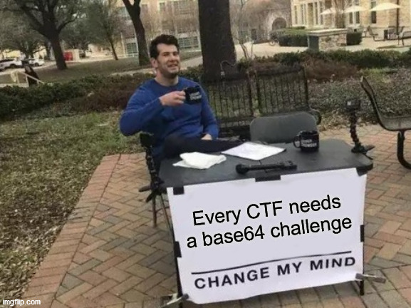

# Introduction

Participated in this CTF in August and the write up was done in August but was too busy with University. Finally got around to touch up the original writeup and put it on the blog.

# TISC 2020 Write up 

This is a write-up on TISC 2020. Probably the most challenging CTF I have played in SG. Interesting challenges that are actually solvable without too much guessing. This is the quality CTF I hope local CTF can aim towards. 

Disclaimers: Some screenshots are recreated during this write-up to illustrate certain points that I did not think was important during the competitions, which turned out to be important to explain stuff in write-up. Thus there may be some inconsistencies in shell environments and etc.

# Stage 1





## Getting started

The initial inspection of the challenge leads me to a github repository. However, this is a dead end as there are no hidden files and the link in the script below leads to nowhere.




So I decided to connect to the service provided using the script below

```python
from pwn import *

token = "QEHqrUlewAbQxJUaHxNqcbHJioGMlhSLUEsyOIjoNlmDDICAQTcsiyoeaLcYhTQI"
flag = ""

r = remote("fqybysahpvift1nqtwywevlr7n50zdzp.ctf.sg", 31081)

r.sendline(token)
r.sendline(flag)

r.interactive()
```

And I received the challenge zip file through an URL link.


## Cracking the zip

The zip file is said to be encrypted with a 6 digit hexadecimal password. It is easy enough to crack. So I used frackzip to crack the zipfile. At the point of challenge I am not sure if the hexadecimal includes A-F or a-f. So I decided to use both. It just took a little longer


## Solution

The file decrypted is identified as Tex font Metric data. That seems wrong. So I binwalked the file and realised it is actually zlib compressed data. A few round of decompression revealed that doing this manually is going to take quite a while.


So I decided to write a script as I progressed through the decompression and decoding.

```python
import subprocess
import os
import zlib, gzip, bz2, lzma, base64

filename = "out"
counter = 0
data = ""
with open("temp.mess", "rb") as f:
    data = f.read()

with open(filename, "wb") as f:
    f.write(zlib.decompress(data))


while True:
    file_output = str(subprocess.check_output(['file',filename]))
    if "zlib" in file_output: 
        with open(filename, "rb") as f:
            data = f.read()
        with open(filename, "wb") as f:
            f.write(zlib.decompress(data))
    if "gzip" in file_output:
        with open(filename, "rb") as f:
            data = f.read()
        with open(filename, "wb") as f:
            f.write(gzip.decompress(data))
    if "bzip2" in file_output:
        with open(filename, "rb") as f:
            data = f.read()
        with open(filename, "wb") as f:
            f.write(bz2.decompress(data))
    if "XZ" in file_output:
        os.system("mv out out.xz; xz -d out.xz")
    if "ASCII" in file_output:
        with open(filename, "r") as f:
            data = f.read()
        
        try:
            d = bytearray.fromhex(data)
            with open(filename, "wb") as f:
                f.write(d)
        except:
            d = base64.b64decode(data)
            with open(filename, "wb") as f:
                f.write(d)
        if "TISC" in str(d):
            break


    counter += 1
    if counter > 500:
        break
print (counter)
```

After 155 rounds of this, we found the flag.


<div style="page-break-after: always; break-after: page;"></div>

# Stage 2



## Getting Started

I downloaded the `encrypted.zip` and extracted the contents. Since there is a warning in the challenge description, I decided to use the docker provided to do further investigations. I modified the Dockerfile slightly to fit my own workflow.


I also found out that the file `anorocware` is packed with upx. So quick `upx -d anorocware` unpacked the file. From now on I will not repeat this step in the write up for stage 3 and 4 since I used the same binary for both challenges.


## Analysis and Solution

The unpacked binary reveals that it's an unstripped golang binary. Although there are thousands of runtime functions that golang pack into a simple binary, we can always target specific API calls to achieve our reverse engineering goals.

This challenge wants me to find a base64 encoded string which decodes into a public certificate. So we can target the Golang API for base64 decryption. Namely encoding/base64.DecodeString(). So we just set a breakpoint in gdb


Run the program until it enters the DecodeString Function where the breakpoint is triggered. And extract the parameter passed in.


After verifying that this is indeed the right base64 string, we get the sha256sum of it and submit the flag


<div style="page-break-after: always; break-after: page;"></div>

# Stage 3

No more getting started since we are using the same binary and same docker setup.


## Analysis

This challenge wants me to decrypt the files encrypted by the ransomware `anorocware`. Following the method I used in Stage 2, I tried to find the relevant APIs to narrow down the target. Since the program needs to encrypt files, it is natural to assume it needs to read file -> encrypt file -> write file. Thus looking at xrefs of io_ioutil_readfile, we find an interesting function main_visit_func1.


After some analysis, I found out that main_visit_func1 takes in a file path and encrypt the file with generated EncKey and EncIV using AES CTR mode. Then write the file with filename + .anoroc. To decrypt the files, we need to find out what EncKey and EncIV is used for the encryption of our target files.

### IV analysis

Brief analysis of `main_vist_func1` reveals that it is using AES CTR mode for encrypting files under the current directory. And it is changing the first 2 bytes of IV to the first 2 bytes of the filename of the file it is encrypting. (I created some files named AABB BBCC CCDD to verify this)


### Key and IV

Although we know the first 2 bytes of the IV, we still need to find out how to get the key and the rest of the IV used to encrypt the files. As I found out  that the Key and IV are generated randomly using the random function.


It took me a while to figure out how to get the key and IV and it was discovered by accident. During my initial analysis I found out that the program doesn't delete your original files or traverse out of your current directory. So you can safely put the program in a separate folder with your test files. That's when I realised that the program also create 2 more files, namely `keydetails-enc.txt` and `ransome-anoroc.txt`. These 2 files do not have the .anoroc suffixes thus must be generated outside of main.visit.func1. And keydetails-enc.txt seems interesting enough to be investigated. However it seems to be encrypted and we need to figure out how to decrypt it.

By placing breakpoints on `WriteFile` function shows that keydetails-enc.txt is created at the following region.


We also see the math/big(*Int)Exp function which immediately reminded me of RSA encryption. Debugging this Exp function revealed something interesting


Debugging for x, y, m reveals that x is the keyenc in plaintext, y is always 3 and m is some very large number used as modulus. Later I realised that m is actually the certificate as public key from stage 2. And the string is reversed in this image because how golang math/big.nat.setBytes changes the memory structure of the bytes. Something about endianness that took me a while to extract the memory and test it out myself.

After this operation, the result is written to the keyenc file.

#### Summary

1. The program generate EncKey and EncIV and get some information from online 
2. URL encodes the whole thing to a string. 
3. The string is "encrypted" by doing x**y % m where x is the plaintext, y = 3 and m = public certificate. 
4. The result is written to keydetails-enc.txt.

#### Vulnerability

The implementation of this "RSA" like algorithm is that the x and y is much smaller than m. So keydetails-enc.txt can be easily solved by taking cube root of the number and unhex the result.

```python
import binascii
from pwn import *

def nth_root(x, n):
    # Start with some reasonable bounds around the nth root.
    upper_bound = 1
    while upper_bound ** n <= x:
        upper_bound *= 2
    lower_bound = upper_bound // 2
    # Keep searching for a better result as long as the bounds make sense.
    while lower_bound < upper_bound:
        mid = (lower_bound + upper_bound) // 2
        mid_nth = mid ** n
        if lower_bound < mid and mid_nth < x:
            lower_bound = mid
        elif upper_bound > mid and mid_nth > x:
            upper_bound = mid
        else:
            # Found perfect nth root.
            return mid
    return mid + 1

keyenc = 0x4aca8af91f97ef198ba32c820e8868deb693f86f763d3a2879a84fa8e7af6f396107701b480e453ec69b7e3f72f02520f408a98c163db6c70f9902eab87c882b73c158e16be95dc4a9921fec3297586343b250f6cf58f3512e37de84e2f3d12639bec4f88ed5e68226fad6c2e5dbdfe9b44350aaedc61015e8f28cce50a69c67f919f0c5d2c2c9073bf4d25afb299e65acf703880949b32f5e442e77cf527f6a8a3881ba1f94e79103abb9c1a1f55a4735488e05d0a41fd7feb3b7c130c2139dcc4301a55d87806e04f45ce210ecbc971bfaf7a2ff090f39709f4025f658f7729eb1cfbef40cfce7d469d1095f60144e2f312b6493ce0cca3765189089425a04d035cdd6a80b131b231215141ae83f2a3410fc551ca30296be4ad3f7bf4cdb1e09583f97d445150c037f88d7ca765174f8b202b6a5f513dd9f20b430bbbbfc2309293271faac024b38cde3fc22555cd860ef79ae16697982e37650c933ced29879280f2301d7efcc4967dd77e668a65afbc770d46669e67678f347c5d85ffe05218d8ebeec470ca1d74ae8956589db43999a1643a95b0a72acf6ace052fdef8bcc63dc7ce67024866d4e7cb421965218614a41e0789c7239733e6f97c00f1db05bff3e1283e3790a4a9ac2e6f1cfa5084555f4412da28d7434bfa27d6b4cdf4da50889c9285c8ca0e606398bfb3b34894752667df01a28023b7297d3a16978f4a974cf2d04088

print (binascii.unhexlify(hex(nth_root(keyenc,3))[2:]))
```


### Solution

With Key and IV, I am able to decrypt the files required. By reversing the program and copying some sample code from golang cipher examples, I came up with the following golang code that can decrypt any files encrypted by anorocware.

```go
package main

import (
    "crypto/aes"
    "crypto/cipher"
    "fmt"
    "io/ioutil"
    "os"
    "net/url"
)

func decrypt(key []byte, iv []byte, filename string) {

	// Load your secret key from a safe place and reuse it across multiple

	// NewCipher calls. (Obviously don't use this example key for anything

	// real.) If you want to convert a passphrase to a key, use a suitable

	// package like bcrypt or scrypt.

    ctx, _ := ioutil.ReadFile(filename)


	block, err := aes.NewCipher(key)

	if err != nil {

		panic(err)

	}


	// The IV needs to be unique, but not secure. Therefore it's common to

	// include it at the beginning of the ciphertext.

	ptx := make([]byte, aes.BlockSize+len(ctx))


	stream := cipher.NewCTR(block, iv)

	stream.XORKeyStream(ptx[aes.BlockSize:], ctx)


	fmt.Printf("%s/n", ptx)

    ioutil.WriteFile(filename+".decrypted", ptx[aes.BlockSize:], 0644)
}


func main() {
    queryStr := "City=Singapore&EncIV=%1C%9F%A4%9B%2C%9EN%AF%04%9CA%AE%02%86%03%81&EncKey=%99z%11%12%7FjD%22%93%D2%A8%EB%1D2u%04&IP=112.199.210.119&MachineId=6d8da77f503c9a5560073c13122a903b"
    params,_ := url.ParseQuery(queryStr)

    fmt.Println("Query Params:")
    for key, value := range params {
        fmt.Printf(" %v = %v/n", key, value)
    }
    key := []byte(params["EncKey"][0])
    iv  := []byte(params["EncIV"][0])

    filename := os.Args[1]

    fmt.Println(filename)
    iv[0] = []byte(filename)[0]
    iv[1] = []byte(filename)[1]

    decrypt(key, iv, filename)
}

```

And we found the flag in secret_investments.db


<div style="page-break-after: always; break-after: page;"></div>

# Stage 4


## Analysis

To find the randomly generated domain, I looked through the decompiled code of `anorocware` and found several net api usage. The one that uses a randomly generated domain is in the region as shown below


And there is a very interesting custom function `main_QbznvaAnzrTrarengvbaNytbevguz`. Analysis reveals that this function is responsible for generating the random domain. Analyzing the function shows that It is seeding the random function. This is to ensure the random function will deterministically generate the same sequence of number given the same seed. And the challenge want us to find the randomly generated domain at any given time. So the seed must be related to the time.


I spent a lot of time trying to understand how the program is using the information from worldtimeapi.org and our system time.Now(). However it turns out that it's mostly a waste of time. I should have beelined for the critical API such as seed and reverse from there like I did in the previous 2 stages. Anyways, the debugger shows the following:


We can see that this is basically math.rand.Seed($rdx >> 0xf). And $rdx is actually our current epoch time. So we can just change the epoch time / generate the seed ourselves to seed the random function for any given time.

## Solution

I think the intended solution is to reverse the function and generate the domain ourselves. However, after spending so much time reversing the previous parts manually, I decided to use a more hackish method. 

I passed a series of command to gdb to make it 

1. Place the breakpoints before seeding and before concat("http://", domain)
2. run until before seeding
3. change seed to our seed
4. continue running till before concat
5. extract domain

And I parsed the output of gdb in python to get the domain. This took longer than expected because for some reason gdb sometime fails to break at desired locations and there were some artefacts in output which is fixed by getting the length of domain and just truncating the output to the length. 

After much debugging it finally works and I just put it into a loop and waited for it to solve 100 domains. The script I wrote parsed the gdb output with the expectation of GEF extension. I have not tested it on vanilla gdb so use at your own discretion.

```python
from pwn import *
import time
from calendar import timegm
import subprocess
import os


def get_domain(seed):
    cmds = """
    set verbose off
    break *0x0000000000661501
    break *0x0000000000661726
    run
    set $rdx={0}
    continue
    
    define fn
    x/1s $rax
    p $rcx
    end

    fn

    quit
    """
    cmdtxt = cmds.format(seed)
    if os.path.exists("cmd.txt"):
        os.system("rm cmd.txt")

    with open("cmd.txt","w+") as f:
        f.write(cmdtxt)
    
    while True:
        try:
            output = subprocess.check_output(["gdb", "--command=cmd.txt","--batch","anorocware"]).decode("utf-8")
            break
        except:
            time.sleep(5)
            pass
    
    output = output.split("/n")
    domainout = output[-3]
    lenout  = output[-2]
    domainout = domainout.split("/"")[1].split("/"")[0]
    lenout = lenout.split("=")[1]
    lenout = int(lenout, 16)
    domain = domainout[:lenout]

    return domain


def getseed(timestr):
    utc_time = time.strptime(timestr, "%Y-%m-%dT%H:%M:%S.%fZ")
    epoch_time = timegm(utc_time)

    return hex(epoch_time>>0xf)


token = "QEHqrUlewAbQxJUaHxNqcbHJioGMlhSLUEsyOIjoNlmDDICAQTcsiyoeaLcYhTQI"

r = remote("fqybysahpvift1nqtwywevlr7n50zdzp.ctf.sg", 31090)

r.sendline(token)

with open("log.txt","a+") as f:
    f.write("BEGINNING A NEW TRIAL")

while True:
    print (r.recvuntil("servers on "))
    timestr = r.recvuntil("Z").decode("utf-8")
    seed = getseed(timestr)
            
    print ("[+]timestr:", timestr)
    print ("[+]seed:", seed)
 
    domain = get_domain(seed)
    print (domain)
    
    with open("log.txt","a+") as f:
        f.write("timestr:"+timestr+"/n")
        f.write("seed:"+seed+"/n")
        f.write("domain:"+domain+"/n")
        f.write("-"*80+"/n")

    r.sendline(domain)


r.interactive()
```

# Conclusion

After stage 4 I am pretty exhausted and I have 12 more hours and I needed to rest to attend a University Lecture the next day. So I decided to stop the attempt. On hindsight, I could have solved these challenges much more efficiently. A lot of the challenges I faced are caused by my unfamiliarity with the tools I have at disposal and tunnel visioning on dead ends. Instead of doing a depth first search on solutions, I should try to do more breadth first search and explore my options. I also should have done more active debugging on complex programs like this to find patterns and relationships between the functions.

All in all it was a great experience and time well spent. I have a much deeper understanding on how golang works under the hood and will probably be much more efficient in analyzing golang binaries in the future.

